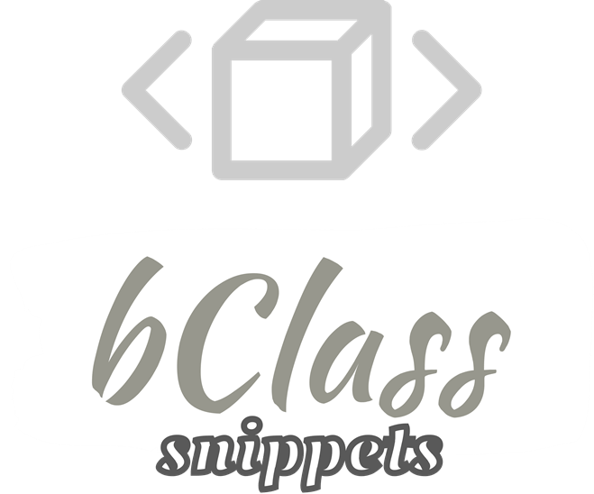

  

  <h3 align="center">
    bClass snippets
     
  </h3>

  

    animations | components | media-player | theme-colors | theme-css | theme-js
     
    ( html / vue / react )
       
  

## Table Of Contents

- [About](#about)
- [Features](#features)
- [Documents](#documents)
- [Usage Rights](#usage-rights)
  - [Licensees Rights](#licensees-rights)
  - [Users Rights](#users-rights)
- [License](#license)

## About

Snippets for bClass libraries, all in one place. With this tool you can easily use bClass libraries.

# Features

- bClass animations snippets
- bClass components snippets
- bClass media-player snippets
- bClass theme-colors snippets
- bClass theme-css snippets
- bClass theme-js snippets

# Documents

> **bClass-animations for [documentation](https://github.com/EW-EndWall/bClass-animations/blob/main/versions/latest/docs/README.md)**
> **bClass-components for [documentation](https://github.com/EW-EndWall/bClass-components/blob/main/versions/latest/docs/README.md)**
> **bClass-media-player for [documentation](https://github.com/EW-EndWall/bClass-media-player/blob/main/versions/latest/docs/README.md)**
> **bClass-theme-colors for [documentation](https://github.com/EW-EndWall/bClass-theme-colors/blob/main/versions/latest/docs/README.md)**
> **bClass-theme-css for [documentation](https://github.com/EW-EndWall/bClass-theme-css/blob/main/versions/latest/docs/README.md)**
> **bClass-theme-js for [documentation](https://github.com/EW-EndWall/bClass-theme-js/blob/main/versions/latest/docs/README.md)**

# Usage Rights

## Bik Public License 2.0 | Rights

According to this license text, the rights of the license holder and users are as follows:

### Licensees Rights

> [!WARNING]
>
> - The licensee who owns the copyright of the work has the right to protect the work and through this license grants its users the right to use it under certain conditions.
> - Has the right to determine and change the license of the work.
> - Has the right to grant permission for commercial use.
> - Has the right to allow the redistribution of the work under certain conditions.
> - In terms of liability, we cannot be held responsible for any damage or loss arising from the use of the work.

### Users Rights

> [!IMPORTANT]
>
> - The user has accepted the license terms and has the right to use the work as long as it complies with these rules.
> - Has the right to change the work as she wishes, but these changes must not violate the license conditions.
> - Has the right to use it for commercial purposes.
> - It has the right to redistribute the work, but cannot rename it, and when doing this, it must preserve the original license and copyright notice, that is, the original license holder must also be stated.
> - The user is responsible for any damage that may occur while using the work.

> [!CAUTION]
> These rights and responsibilities specify the relationship between the licensee and the user and the basic rules governing the use of the work. If the user does not comply with the license terms, the license automatically terminates and he cannot claim any rights.

## License

> Distributed under the Bik Public License 2.0 License. See [LICENSE](./LICENSE) for more information.
